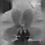
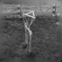

# Expanding small grey-scale pictures 
A pytorch-project that trains a CNN-model to expand small grey-scale images at their borders. 
The scripts cover data pre-processing, like grayscaling, cropping, scaling and some final preparations, 
as well as training and deplyoment of the model.
Here are some example outputs:

   

[TODO] Intro
